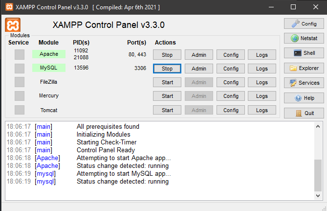

# Trabalho Final - CSI606-24.1

## Por Samuell Aguiar - 21.2.8025

### -> Resumo

 Este projeto consiste em uma aplicação WEB que permite aos usuários criarem seu pedido, cancelarem seu pedido e ver o valor do pedido à medida que eles editam os ingredientes dela, além de haver uma página de administrador que conta com a possibilidade de cancelar um pedido, receber um relatório dos pedidos registrados, dos ingredientes cadastrados e dos usuários cadastrados.

### -> Funcionalidades Implementadas

- Criar sua pizza;
- Remover uma pizza do seu carrinho;
- Saber o valor da sua pizza em tempo real;
- Ter uma página de administrador;
- Analizar com as pizzas realizadas;
- Administrador cancela um pedido;
- Gerar relatório relatório de Ingredientes;
- Gerar relatório relatório de Usuários cadastrados;
- Gerar relatório relatório de Pedidos.

### -> Desafios e Dificuldades

Um dos principais desafios foi a implementação da funcionalidade dos preços para cada ingrediente e fazer a soma em tempo real de escolha. Tendo em vista que nunca havia feito algo nesse sentido, foram necessários muitos estudos e testes para implementar tal função.

### -> Como Executar:

- Clone este repositório para a sua máquina local:
  - Git clone https://github.com/SamuellAguiar/Projeto_Sistemas_WEB.git no caminho C:\xampp\htdocs
  - Cole o arquivo `/db/db.txt` no MySQL WorkBench
  - Inicie o XAMPP e deixe rodar o Apache e MySQL durante a utilização do projeto:
  
  - Cole no seu navegador:
    - http://localhost/PizzariaWEB/
